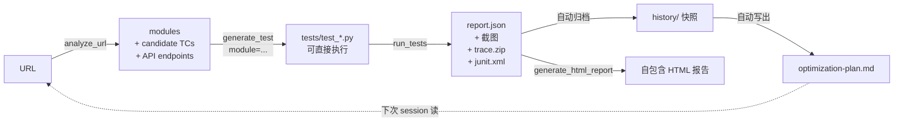

<p align="center">
  
</p>

<h1 align="center">Common-test-MCP ｜ Common-test-MCP</h1>

<p align="center">
  <em>你的 AI QA 全链路工具 — 分析、生成、执行、给建议。</em>
</p>

<p align="center">
  <a href="README.md">English</a> · <a href="README.zh-TW.md">繁體中文</a> · <strong>简体中文</strong>
</p>

<p align="center">
  <a href="https://pypi.org/project/Common-test-MCP/"></a>
  <a href="LICENSE"></a>
  <a href="https://www.buymeacoffee.com/minikao"></a>
</p>

> 跨 pytest / Jest / Cypress / Go 的通用测试执行 MCP server，内建 DOM 分析器、执行历史记录、与自我强化教练。

一个基于 **Model Context Protocol** 的服务器，让 Claude Desktop / Cursor / 任何 MCP client 端到端驱动你的测试流程：执行测试、检视失败（截图 + 视频 + Playwright trace）、分析一个 URL 自动产生候选测试案例，并在每次跑完后吐出一份**下一轮该优化什么**的优先级行动清单。

| `QA_RUNNER` | 框架 | 语言 | 目标 |
|---|---|---|---|
| `pytest` / `pytest-playwright` / `playwright` | pytest + Playwright | Python | Web |
| `jest` | Jest | JavaScript | Web |
| `cypress` | Cypress | JavaScript | Web |
| `go` / `go-test` | `go test` | Go | Backend |
| `maestro` / `mobile` | Maestro | YAML | iOS + Android |
| `schemathesis` / `api` | Schemathesis | OpenAPI 3.x / Swagger 2.0 | API（v0.6.0 起） |
| `newman` / `postman` | Newman | Postman collection v2.x | API（v0.6.1 起） |

完整设计文件：[`docs/framework.md`](docs/framework.md)。

---

## 功能总览

- **跨框架执行测试**（web + mobile + API），单一 MCP 接口对接所有 runner
- **移动端通过 Maestro**（v0.3.0 起）：同样 MCP tool 集、iOS Simulator / Android Emulator / 真机都通；YAML flow 跨平台共用
- **原生 API 测试 — 两个 runner**（v0.6.0 / v0.6.1 起）：API 测试这格目前并列两个 runner，各自吃你团队已经在维护的 artifact。
  - **Schemathesis**（`QA_RUNNER=schemathesis`，v0.6.0 起）：喂 runner 一个 OpenAPI 3.x / Swagger 2.0 URL 或 `file://` schema，自动产生 property-based fuzz 测试案例，涵盖 status code、response schema、content-type、`5xx` 受 fuzz 影响等检查。
  - **Newman**（`QA_RUNNER=newman`，v0.6.1 起）：喂 runner 一个 Postman 2.x 导出的 collection（可选带 environment / globals），Newman 会 replay 每个 request、执行内嵌的 `pm.test(...)` assertion，每个 assertion 对应一个 Common-test-MCP nodeid。**Newman 是系统依赖**（`npm install -g newman`）—— 它是 npm 包不是 pip，所以没有 Python extra 可装。

  两个 runner 都沿用同一套 MCP tool surface，且共用 `report.json` / history / flake / optimizer pipeline。已经用 pytest+`httpx`、Jest+`supertest`、Cypress `cy.request()`、Go `net/http/httptest` 写好的 API 测试**仍然走原本的 runner，不需要迁移**。Pact provider verification 维持在 v0.7.0 条件式 roadmap。
- **失败产物完整**：截图（base64 内嵌）、视频、Playwright trace.zip / Maestro recording
- **执行历史**：每次 run 自动快照；HTML 报告含 sparkline 趋势线
- **DOM / Screen 分析器** — `analyze_url`（web，抓 form / nav / dialog / CTA + 该页打的 API + 跑版检测）跟 `analyze_screen`（mobile，通过 `maestro hierarchy` 抓 form / cta / tab_bar）
- **智慧测试生成**（`generate_test`）：喂 analyzer 拆出来的 module，产出**可直接执行**的 Playwright `.py` 或 Maestro `.yaml`（不再是 `# TODO` 占位）
- **自动 retry flaky tests** — pytest 端通过 `pytest-rerunfailures`、Maestro 端通过自写 retry wrapper（Maestro 没原生 `--reruns`）；retry 才 pass 的测试会单独列为 flaky
- **自我强化教练**（`get_optimization_plan`）：每次 run 结束后三层分析 — 测试套件品质、MCP 使用模式、AI 生成效益
- **JUnit XML 输出**，CI 直接吃（GitHub Actions / Jenkins / GitLab）

---

## 安装

两条路线，看你怎么用：

### A. 用 `uvx` 跑（零安装，推荐给一般使用者）

在 client config 加 `Common-test-MCP`，不用全局装任何东西；[`uv`](https://docs.astral.sh/uv/) 会每次帮你抓并在隔离环境跑：

```json
{
  "mcpServers": {
    "Common-test-MCP": {
      "command": "uvx",
      "args": ["Common-test-MCP"],
      "env": { "QA_RUNNER": "pytest", "QA_PROJECT_ROOT": "/path/to/your-test-project" }
    }
  }
}
```

整个设置就这样。第一次调用会下载，后续走 cache。要指定版本：`uvx Common-test-MCP@0.4.1 ...`。

### B. 装进自己的 venv（给贡献者 / 想 hack 的人）

```bash
pip install Common-test-MCP       # 或 git clone 后 pip install -e .
playwright install                # pytest-playwright 才需要
pip install pytest-rerunfailures  # 选用，启用自动 retry
```

client config 指向同一个 Python：

```json
"command": "/path/to/.venv/bin/python",
"args": ["-m", "common_test_mcp.server"]
```

### 各 runner 的先决条件

| `QA_RUNNER` | 还要先装 |
|---|---|
| `pytest` / `pytest-playwright` | `pip install pytest-playwright` + `playwright install chromium` |
| `jest` | Node 项目 + `npm i -D jest` |
| `cypress` | Node 项目 + `npm i -D cypress` |
| `go` | Go toolchain 在 PATH |
| `maestro` | [Maestro CLI](https://maestro.mobile.dev/) + 模拟器 / 真机 / BlueStacks（通过 `adb connect`） |
| `schemathesis` / `api` | `pip install 'Common-test-MCP[api]'`（自动拉 `schemathesis>=3.0,<4`） |
| `newman` / `postman` | `npm install -g newman`（Newman 是 npm 包，不是 pip——没有 extra 要装） |


## API 测试（`QA_RUNNER=schemathesis`）

把 runner 指向任何 OpenAPI 3.x / Swagger 2.0 schema，Schemathesis 就会 per
operation 产生 property-based 测试案例 — 涵盖 response schema conformance、
status code conformance、content-type 检查、被 fuzz 打到 `5xx` 的情况。
结果跟 UI 测试走同一条 `report.json` / history / flake / optimizer pipeline。

端到端教学：[`docs/walkthrough-api.md`](docs/walkthrough-api.md)。
3 endpoint 范例 schema：[`examples/sample_api_project/`](examples/sample_api_project/)。

### 5 行设置

```jsonc
"env": {
  "QA_RUNNER": "schemathesis",
  "QA_OPENAPI_URL": "https://api.example.com/openapi.json"
}
```

### 环境变量

| 变量 | 必填 | 默认 | 作用 |
|---|---|---|---|
| `QA_OPENAPI_URL` | 是 | — | OpenAPI 路径。`http(s)://...` 或 `file://...`。**纯文件路径不接受**——一律加 `file://` 前缀避免相对/绝对解析歧义。 |
| `QA_SCHEMATHESIS_CHECKS` | 否 | `all` | 逗号分隔子集：`response_schema_conformance,status_code_conformance,not_a_server_error,content_type_conformance,response_headers_conformance`。 |
| `QA_SCHEMATHESIS_AUTH` | 否 | — | Authorization header 值。以 `-H "Authorization: <value>"` 传入；不会写进 log，archived report 也会做敏感字串遮罩。 |
| `QA_SCHEMATHESIS_MAX_EXAMPLES` | 否 | `20` | 每个 operation 的 Hypothesis sample 数。越大 fuzz 越深、跑越久。 |
| `QA_SCHEMATHESIS_DRY_RUN` | 否 | `0` | 设 `1` 启用「planning only、不打 HTTP」模式 — 对 production 做安全 preview、或 CI 只跑 schema-only smoke 时用。 |
| `QA_NO_REDACT` | 否 | `0` | 关闭 archived report 的敏感字串遮罩。默认遮罩 `Authorization: Bearer …`、`"password": …`、`"token" / "api_key" / "secret" / "access_token" / "refresh_token": …`。 |

原本的 `QA_TIMEOUT_SECONDS`（默认 600s）依然作用。


## API 测试（`QA_RUNNER=newman`）

把 runner 指向任何导出的 Postman 2.x collection，Newman 6.x 会 replay 每个
request、执行内嵌的 `pm.test(...)` assertion，每个 assertion 变成一个
Common-test-MCP nodeid。结果跟 Schemathesis、UI 测试共用同一条 `report.json` /
history / flake / optimizer pipeline。

**系统依赖**：Newman 是 npm 包不是 pip，请先全局安装：

```bash
npm install -g newman
```

没有 `pip install 'Common-test-MCP[postman]'` extra——runner 只是 shell out
到 PATH 上的 `newman` binary。没装会丢出明确的 `ImportError` 提示。

OpenAPI 范例对应的同一个 3-endpoint **Library API**，同时以 Postman
collection 形式收在
[`examples/sample_api_project/postman-collection.json`](examples/sample_api_project/postman-collection.json)。
配 `prism mock examples/sample_api_project/openapi.yaml` 起 mock server，
就能完全离线玩；或者指向你自家的 staging server。

### 5 行设置

```jsonc
"env": {
  "QA_RUNNER": "newman",
  "QA_POSTMAN_COLLECTION": "/absolute/path/to/your-collection.json"
}
```

### 环境变量

| 变量 | 必填 | 默认 | 作用 |
|---|---|---|---|
| `QA_POSTMAN_COLLECTION` | 是 | — | Postman 2.x collection JSON 的纯文件路径。**不用 `file://` 前缀**——Newman 不需要 scheme 区分（collection 本来就只会在本机）。 |
| `QA_POSTMAN_ENVIRONMENT` | 否 | — | Postman environment 文件的纯路径（`-e <path>`）。提供 `{{var_name}}` placeholder 的值。 |
| `QA_POSTMAN_GLOBALS` | 否 | — | Postman globals 文件的纯路径（`-g <path>`）。同 environment shape，全局作用。 |
| `QA_POSTMAN_ITERATIONS` | 否 | `1` | 整个 collection replay 几次（`-n <N>`），soak test 跟 flake 检测时用。 |
| `QA_POSTMAN_FOLDER` | 否 | — | CSV 逗号分隔的 Postman folder 名称，限缩这次 run 的范围（重复的 `--folder` flag）。`run_failed` 也会用 folder-scoping 来重跑。 |
| `QA_POSTMAN_TIMEOUT_REQUEST_MS` | 否 | `30000` | 单一 request 的 HTTP timeout（毫秒，`--timeout-request`）。与 `QA_TIMEOUT_SECONDS`（整个 subprocess 的天花板）不冲突。 |
| `QA_NO_REDACT` | 否 | `0` | 与 Schemathesis runner 相同的遮罩策略——只在 short debug 时关掉。 |

原本的 `QA_TIMEOUT_SECONDS`（默认 600s）依然作用。


## AI 视觉挑战解析（v0.7.0）

> *当后端 bypass 不可行时：Claude 看 CAPTCHA、Common-test-MCP 负责点下去。*

支持 reCAPTCHA v2（v0.7.0 起）与 hCaptcha（v0.7.1 起）。

家族里第一个 **AI client 视觉能力是必要、不是加分项**的功能。新增两个
MCP tool（`inspect_visual_challenge` + `solve_visual_challenge`）——
检测当前 Playwright 页面上的 reCAPTCHA v2 或 hCaptcha image-grid
挑战、截图丢给多模态 AI client、接收 AI 回传的 tile 选择、执行点击链。
Runner 是「眼睛跟手」，AI client（Claude / Cursor / Gemini / GPT-4o）
才是真正的解题者。

### 什么时候用 — Tier 1 vs Tier 3

内建 QA 知识层（`get_qa_context section="CAPTCHA"`）把策略分成三层，
照顺序套：

| Tier | 做法 | 适用 |
|---|---|---|
| **1 — bypass** | reCAPTCHA test keys、feature flag、IP allowlist、test-mode headers | 默认首选，~90% 的情境都用这个 |
| **2 — degrade** | 标为 `external_dependency`、跳过下游断言 | 改不到后端、但测试本身不是针对 CAPTCHA |
| **3 — AI 视觉判断** | 本功能 | 1 + 2 都不行时：客户网站有授权但拿不到后端、staging 完整镜像 production CAPTCHA、移动 webview 无法 IP allowlist |

### 同意 (Consent) 闸门

默认关闭、没明确 opt-in 不做事。两个环境变量驱动：

| 变量 | 必填 | 默认 | 作用 |
|---|---|---|---|
| `QA_VISUAL_CHALLENGE_CONSENT` | 是 | `false` | 必须设成 `true`，否则 inspect / solve 都回 `consent_required` 加上完整法律免责声明（AI client 会原样呈现给使用者）。 |
| `QA_VISUAL_CHALLENGE_AUTHORIZED_DOMAINS` | 否（建议设） | — | 逗号分隔的 domain 白名单。**有设**：不在名单的 domain 直接拒绝。**没设**：warn-only — 仍会跑、但 response 带 warning 字串提醒你补设。共用 CI / 多租户环境**强烈建议设**。 |
| `QA_VISUAL_CHALLENGE_TIMEOUT` | 否 | `120` | inspect→solve 整个循环的时间预算（秒）。仍受 `QA_TIMEOUT_SECONDS` 天花板限制。 |

### 快速上手

```jsonc
"env": {
  "QA_RUNNER": "pytest",
  "QA_PROJECT_ROOT": "/path/to/project",
  "QA_VISUAL_CHALLENGE_CONSENT": "true",
  "QA_VISUAL_CHALLENGE_AUTHORIZED_DOMAINS": "client-staging.example.com"
}
```

之后当 `run_tests` 喷 `external_dependency` 且指向 CAPTCHA，AI client
就能升级到 Tier 3：

```
Common-test-MCP.inspect_visual_challenge()   # 截图 + tile 网格
→ AI 视觉判断后选 [0, 4, 7]
Common-test-MCP.solve_visual_challenge(
    challenge_id="...", selected_tile_indices=[0, 4, 7], confirm=true,
)
→ status: "passed"、token: "..."、hint: "CAPTCHA 验证通过。继续跑你的测试。"
```

完整教学：[`docs/walkthrough-visual-challenge.md`](docs/walkthrough-visual-challenge.md)。
PRD：[`docs/prd-v0.7-visual-challenge.md`](docs/prd-v0.7-visual-challenge.md)。

### 硬性禁止 domain

无论 consent 或 allowlist 设成什么，这份名单永远拒绝：
`accounts.google.com`、`login.microsoftonline.com`、`id.apple.com`、
`facebook.com`、`login.live.com` 等知名第三方登录入口。对别人家的
登录页解 CAPTCHA 没有任何合理的 QA 场景。

### 隐私

inspect→solve 循环结束后**完全不保留截图**。Telemetry 只记 boolean
结果——绝不记截图、不记题目文字、不记 tile 选择。5 分钟 LRU cache 最
多保留 10 个未完成挑战、且完全不写硬盘。

### 成功率提醒

实际判题的是 AI client 的视觉模型——Claude Sonnet 4 / GPT-4o /
Gemini 2.5 都内建视觉，但在 3x3 reCAPTCHA 上的准确率各有差异。请预
留至少一次重试（reCAPTCHA 锁出前给 3 次）。后续 `get_telemetry` 会
汇整 pass-rate，方便依 client 调整预期。

**范围**：v0.7.0 只支持 reCAPTCHA v2 image-grid。hCaptcha 排 v0.7.1。
reCAPTCHA v3 / Cloudflare Turnstile 永远不在计划内——它们根本没有可
视化的挑战可看。


## 接到 Claude Desktop

复制 `examples/configs/claude_desktop_config.example.json` 内容到：

- **macOS**：`~/Library/Application Support/Claude/claude_desktop_config.json`
- **Windows**：`%APPDATA%\Claude\claude_desktop_config.json`

两个关键环境变量：

| 变量 | 范例 | 作用 |
|---|---|---|
| `QA_RUNNER` | `pytest` / `jest` / `cypress` / `go` / `maestro` / `schemathesis` / `newman` | 选择测试框架 |
| `QA_PROJECT_ROOT` | `/path/to/your/project` | 指向受测项目根目录 |

### 各 runner 设置范例

**pytest-playwright**：
```json
"env": { "QA_RUNNER": "pytest", "QA_PROJECT_ROOT": "/path/to/python-project" }
```

**Jest**：
```json
"env": { "QA_RUNNER": "jest", "QA_PROJECT_ROOT": "/path/to/node-project" }
```

**Cypress**：
```json
"env": { "QA_RUNNER": "cypress", "QA_PROJECT_ROOT": "/path/to/cypress-project" }
```

**Go test**：
```json
"env": { "QA_RUNNER": "go", "QA_PROJECT_ROOT": "/path/to/go-project" }
```

**Schemathesis（API）**：
```json
"env": {
  "QA_RUNNER": "schemathesis",
  "QA_OPENAPI_URL": "https://api.example.com/openapi.json"
}
```

**Newman（Postman）**：
```json
"env": {
  "QA_RUNNER": "newman",
  "QA_POSTMAN_COLLECTION": "/absolute/path/to/collection.json"
}
```

---

## 其他 MCP client（不只 Claude）

MCP 是开放协议 — 这个 server 不绑 Claude。同一个 Python process 用
JSON-RPC stdio 跟任何 MCP client 对话。各家差别在 (1) config 文件格式跟
(2) 底层 model 自动串接 tool 的可靠度。

| Client | Config 位置 | 格式 | Model | Tool 串接品质 |
|---|---|---|---|---|
| Claude Desktop / Cursor | `~/Library/Application Support/Claude/...json` · `~/.cursor/mcp.json` | JSON | Claude Opus / Sonnet | 主要测试对象 |
| **Codex CLI** | `~/.codex/config.toml` | **TOML** | GPT-5 系列 | 强（GPT-5 chain-of-tools 训练深） |
| **Gemini CLI** | `~/.gemini/settings.json` | JSON | Gemini 3.1 Pro / Flash | 可用、但偏 reactive，prompt 越明示越好 |
| Cline / Continue / Zed | 各自的 MCP config slot | 不一 | 依设置的 model | 依底层 model |

Repo 内附三份范例：
[`codex-config.example.toml`](examples/configs/codex-config.example.toml) ·
[`gemini-config.example.json`](examples/configs/gemini-config.example.json) ·
[`claude_desktop_config.example.json`](examples/configs/claude_desktop_config.example.json)。

**Codex（TOML）**：
```toml
[mcp_servers.Common-test-MCP]
command = "/path/to/.venv/bin/python"
args = ["-m", "common_test_mcp.server"]
cwd = "/path/to/Common-test-MCP"
[mcp_servers.Common-test-MCP.env]
QA_RUNNER = "pytest"
QA_PROJECT_ROOT = "/path/to/your-test-project"
```

**Gemini（JSON，跟 Claude Desktop 结构几乎一样）**：
```json
{
  "mcpServers": {
    "Common-test-MCP": {
      "command": "/path/to/.venv/bin/python",
      "args": ["-m", "common_test_mcp.server"],
      "cwd": "/path/to/Common-test-MCP",
      "env": {
        "QA_RUNNER": "pytest",
        "QA_PROJECT_ROOT": "/path/to/your-test-project"
      }
    }
  }
}
```

我们 tool description 已经写了推荐串接（`analyze_url → generate_test`、
`get_qa_context` 先于领域产测）。**tool-selection 偏弱的 client（如 Gemini）
靠明示「先 X 再 Y」的 prompt 效果最佳**；Claude / Codex 则对隐性串接判断力强。

---

## Tool 清单

所有 runner 共用同一组（部分 tool 在非 pytest runner 上会 graceful 降级）：

| Tool | 用途 |
|---|---|
| `get_runner_info` | 看目前用哪个 runner、有哪些可用 |
| `list_tests` | 列出受测项目内所有测试 |
| `run_tests` | 执行测试（filter / headed / browser；后两者只 pytest-playwright 用） |
| `run_failed` | 重跑上次失败（`pytest --lf`） |
| `get_test_report` | 摘要（pass / fail / skipped / duration / flaky-in-run） |
| `get_failure_details` | 失败详情 + 对应的 screenshot / trace / video 路径 |
| `generate_test` | 产生测试骨架；若提供 `module`（来自 `analyze_url`/`analyze_screen`）会产出「可直接跑」的 Playwright `.py` 或 Maestro `.yaml` |
| `auto_generate_tests` | 一键：analyze URL → 对每个 module 各产一条 test |
| `codegen` | 启动 Playwright codegen（web）/ 指引 `maestro studio`（mobile） |
| `generate_html_report` | 把最近一次测试结果渲染成自包含 HTML |
| `get_test_history` | 最近 N 次 run 摘要（看 flake 与趋势） |
| `analyze_url` | **Web**: DOM 探测 → modules + selectors + candidate TCs + API endpoints + 跑版检测 |
| `analyze_screen` | **Mobile**: `maestro hierarchy` → form / cta / tab_bar modules + candidate TCs（噪音过滤过） |
| `init_qa_knowledge` / `get_qa_context` | 建立 + 读取项目 QA 知识（内建方法论 + 你的领域）。**v0.6.2 起双语**：方法论默认英文 (`QA_LANG=en`)，繁体中文设 `QA_LANG=zh-tw`；两种语言共 13 个区段，最新 4 个涵盖 API 测试方法论、Flaky 根因分类、测试替身（mock / stub / fake / spy）、测试数据管理。领域填法范例：[`docs/qa-knowledge.example.md`](docs/qa-knowledge.example.md)（English: [`docs/qa-knowledge-en.example.md`](docs/qa-knowledge-en.example.md)）。 |
| `get_optimization_plan` | 三层自我强化教练（测试品质 / MCP 使用 / AI 策略） |

### Resources

| URI | 内容 |
|---|---|
| `report://html` | 即时渲染的 HTML 报告（深色模式、自包含） |
| `report://json` | 原始 pytest-json-report JSON |
| `report://optimization` | 最新的 `optimization-plan.md`（自我强化行动清单） |

---

## 自我强化循环

每次 run 结束后，`_archive_report()` 会把 `report.json` 快照进 `test-results/history/`，并写一份新的 `optimization-plan.md`，涵盖三个视角：

1. **测试套件品质** — 每条 test 的历史 outcome 字串（`PFPFP`）→ transition density 算 flake score；连 3 次失败且 error signature 相同 → broken；retry 才 pass → flaky-in-run
2. **MCP 使用模式** — 从 telemetry JSONL 算出高频 tool、错误率、重复 args 模式、常见链（A→B 连续调用）
3. **AI 产测策略** — `generate_test` 写出的测试有没有真的进到下次 run（采用率）；`analyze_url` 检测到的 module 有没有对应的测试文件（覆盖缺口）

行动清单会排优先级（`high` / `medium` / `low`），每条附 target + evidence + suggestion，可选带 `auto_action_hint` 给 MCP client 直接串到下一个 tool call。

---

## 项目结构

```
Common-test-MCP/
├── pyproject.toml
├── src/common_test_mcp/
│   ├── server.py            # MCP 入口（tool 路由 + telemetry 包装）
│   ├── config.py            # 路径与环境变量
│   ├── runners/             # 各框架的 plugin
│   │   ├── base.py          # TestRunner 抽象接口
│   │   ├── pytest_playwright.py
│   │   ├── jest.py
│   │   ├── cypress.py
│   │   └── go_test.py
│   ├── reporters/
│   │   └── html.py          # 自包含 HTML 渲染
│   └── tools/               # 薄层 shim + analyzer + optimizer + telemetry
└── tests_project/           # 受测项目范例（pytest+playwright）
```

---

## 新增一个 runner

1. 在 `src/common_test_mcp/runners/` 新增 `your_runner.py`，继承 `TestRunner`，实作必要的 abstract method
2. 在 `runners/__init__.py` 的 `REGISTRY` 注册名称
3. 完成

---

## 端到端流程

从一个 URL 一路接到「下一轮该优化什么」的完整 pipeline：



这个循环是设计重点：每次 run 喂 optimizer、optimizer 指出最弱的环节、下一次 run 优先攻那一环。

### Walkthrough — 从零测试一个登录页

在 Claude / Cursor session 里：

> **你**：分析 `https://shop.example/login`，帮我写对应测试
>
> **Claude**：[`analyze_url`] 找到 1 个 form (`email_password_form_0`) + 3 个 API endpoints，候选 TC 5 条。
> [`generate_test` 带该 form module] 写了 `tests/test_login.py`，含真实 selectors、不再是 `# TODO` 占位。

> **你**：跑
>
> **Claude**：[`run_tests`] 23 passed、0 failed、31 秒。每条 test 的截图 + step trace 都有。

> **你**：下一步该做什么？
>
> **Claude**：[读 `report://optimization`]
> 最高优先：`tests/test_login.py::test_invalid_credentials` flaky（flake_score=0.4, outcomes=PFPFP）。建议在断言错误消息前加 `wait_for_response('/api/login')`。

optimizer 三层（测试品质 / MCP 使用 / AI 产测效益）让「下一步」永远有数据佐证，不是凭感觉。

### Walkthrough — 测试手机 App（Maestro）

同一个 shape、换 runner。前提：Maestro CLI 已装、simulator/emulator booted、App 已开（或传 `launch_app=true` + `app_id` 自动启动）：

> **你**：分析 你的 App 首页的条码按钮、写对应测试
>
> **Claude**：[`analyze_screen`(app_id="com.example.app", launch_app=true)]
> 找到 15 个可互动元素，其中 `barcode_button`（text="条码"、resource_id="barcodeButton"）+ 候选 TC。
> [`generate_test` 带该 cta module] 写了 `maestro-flows/test_barcode.yaml`：
> `tapOn: { id: barcodeButton }` + waitForAnimationToEnd + takeScreenshot，可直接 `maestro test`。

> **你**：跑
>
> **Claude**：[`run_tests`] 5 个 flow 全 pass、retry 没触发。HTML 报告已含截图。

> **你**：刚刚这个按钮有时候会 fail、为什么？
>
> **Claude**：[`get_optimization_plan`] `barcode_button::barcode_button` 标 flaky（flake_score=0.4、outcomes=PFPFP、rerun_count=1）。建议加 `waitForAnimationToEnd` 或 `extendedWaitUntil` 等动画稳定后再 tap。

移动端特别注意：
- 同一份 `qa-knowledge.md`（内建方法论 + 你的领域）web / mobile 共用 — 业务规则只写一次
- `analyze_screen` 自动过滤 iOS 状态栏（信号 / Wi-Fi / 电池）跟 asset 名称（`bg_*`、`*_filled`）
- Maestro 的 `takeScreenshot: <name>` 指令控制哪些画面会嵌进 HTML 报告

---

## 怎么对 Claude 下指令（Prompting cookbook）

每列：你可以直接贴进 Claude / Cursor session 的中文 prompt → 对应的 MCP tool 调用。
不需要你自己 call tool 名称，用自然语言触发即可。

### 一次性设置
| 你说 | Claude 做 |
|---|---|
| 「初始化 QA 知识文件」 | `init_qa_knowledge` → 在受测项目根建立 `qa-knowledge.md` |
| 「看一下目前的 QA 知识」 | `get_qa_context` → 方法论 + 你的领域内容 |
| 「载入 ISTQB 原则那段」 | `get_qa_context(section="ISTQB")` |

### 日常跑测试
| 你说 | Claude 做 |
|---|---|
| 「跑所有测试」 | `run_tests` |
| 「只跑 login 相关」 | `run_tests(filter="login")` |
| 「重跑刚刚失败的」 | `run_failed` |
| 「看一下结果摘要」 | `get_test_report` |
| 「哪几个失败了、给我截图跟 trace」 | `get_failure_details` |
| 「产一份 HTML 报告」 | `generate_html_report` |

### 从零测一个 URL（web）
| 你说 | Claude 做 |
|---|---|
| 「测试 `https://shop.example/` 的所有模块」 | `auto_generate_tests` 一键交付 |
| 「先分析 `https://shop.example/coupon`、再对每个模块各写 1 条测试」 | `analyze_url` → 对每个 module 一次 `generate_test` |
| 「分析 coupon 页、**参考历史 bug** 写回归测试」 | `get_qa_context(section="历史 Bug")` → `analyze_url` → `generate_test(business_context=...)` |
| 「帮我录结帐流程当 baseline」 | `codegen(url=...)` 开浏览器让你录 |

### 从手机 App 画面写测试（Maestro）
需要 `QA_RUNNER=maestro`、Maestro CLI、且 simulator/emulator/真机 booted。

| 你说 | Claude 做 |
|---|---|
| 「分析 你的 App 现在的画面、写条码按钮的测试」 | `analyze_screen(app_id="com.example.app", launch_app=true)` → `generate_test(module=<cta>)` |
| 「测这个 app 的登录表单」 | `analyze_screen(launch_app=true)` → 挑 `form` module → `generate_test` |
| 「Tab bar 全测一遍、每个 tab 一条 flow」 | `analyze_screen` → 拿 `tab_bar` module → `generate_test` |
| 「用 Maestro Studio 录一个 flow」 | `codegen(url=...)` 会回提示叫你开 `maestro studio` 互动录制、另存 |

### 持续优化（self-improvement loop）
| 你说 | Claude 做 |
|---|---|
| 「下一步该优化什么？」 | `get_optimization_plan` → 排序行动清单 |
| 「最近 5 次 `test_login` 怎样？」 | `get_test_history` + plan lookup |
| 「`test_invalid_pwd` 为什么 flaky？」 | `get_failure_details` + 看评分 |

### Tips：怎么让 Claude 选对工具

- **明示用 QA 知识** — 「**参考 qa 知识**测 coupon」会引导 Claude call `get_qa_context`；不提就会跳过、直接 generate。
- **明示分析步骤** — 「**先分析**再写」走 `analyze_url`；「直接写一个」跳过分析。
- **批次 vs 精挑** — 「一键」对应 `auto_generate_tests`；「对每个模块一条」对应分步 `generate_test`。
- **失败除错** — 直接问「为什么失败 / 给我截图」会走 `get_failure_details`，回传 screenshot/trace/video 路径。

### Anti-patterns（不该这样下指令）

- ❌ 「跑 5 次来判断 flaky」— runner 已有 `--reruns 1` auto-retry + history 记录，直接问「有没有 flaky」用 `get_optimization_plan` 就回得出来。
- ❌ 「一次产 100 条 test」— noise > signal。先用 `get_optimization_plan` 找最该补的，再针对性产测。
- ❌ 「测试所有边界」太空泛 — 改成「测这个 form 的所有 candidate_tcs」更具体可追踪。

---

## 范本输出

### `analyze_url` 结果（节录）

```json
{
  "url": "https://shop.example/login",
  "page_title": "Login",
  "module_count": 3,
  "modules": [
    {
      "kind": "form",
      "name": "email_password_form_0",
      "selectors": {
        "container": "#login",
        "fields": [
          {"label": "Email", "selector": "#email", "type": "email", "required": true},
          {"label": "Password", "selector": "#password", "type": "password", "required": true}
        ],
        "submit": "button[type='submit']"
      },
      "candidate_tcs": [
        "所有必填栏位为空时送出，应显示必填错误",
        "Email 栏位填入格式错误的字串（无 @），应显示格式错误",
        "Password 栏位输入后应默认遮蔽（type=password）",
        "全部填入合法值后送出，应触发成功流程"
      ]
    }
  ],
  "api_endpoints": [
    {
      "method": "POST",
      "path": "/api/login",
      "status": 401,
      "candidate_tcs": [
        "POST /api/login payload 缺必填栏位应回 400 + 栏位错误消息",
        "POST /api/login 合法 payload 应回 2xx",
        "POST /api/login 缺少 auth header 应回 401/403"
      ]
    }
  ]
}
```

### `generate_test` 输出（智慧模式、带 module）

```python
"""
Login happy path

Auto-generated from analyze_url module: email_password_form_0 (kind=form)
"""
from playwright.sync_api import Page, expect


def test_login(page: Page):
    page.goto('https://shop.example/login')
    page.locator('#email').fill('test@example.com')
    page.locator('#password').fill('TestPass123!')
    page.locator("button[type='submit']").click()
    # TC: Email 栏位填入格式错误的字串（无 @），应显示格式错误
    # TC: Password 栏位输入后应默认遮蔽
    # TC: 正确 Email + 正确密码 → 导向 dashboard
    # TODO: 补上实际断言，例如：
    # expect(page).to_have_url(...)
    # expect(page.get_by_text("成功")).to_be_visible()
```

### `optimization-plan.md`（节录）

```markdown
# Optimization Plan — 2026-05-12T14:03:40

_Based on 6 archived runs._

## Prioritized Actions

### 1. 🔴 HIGH — flaky
- **Target**: `tests/test_login.py::test_invalid_credentials`
- **Evidence**: flake_score=0.4, outcomes=PFPFP, rerun_count=1
- **Suggestion**: 加 explicit wait（wait_for_response / locator wait）

### 2. 🟡 MEDIUM — coverage_gap
- **Target**: `register_form`
- **Evidence**: 由 analyze_url 检测但 repo 内找不到对应 test_*.py
- **Suggestion**: `call generate_test(description="...", filename="test_register_form.py")`
```

### HTML 报告

[**直接看实际渲染 →**](https://htmlpreview.github.io/?https://github.com/JkitH/Common-test-MCP/blob/main/sample_report.html)
（通过 htmlpreview.github.io 代理 render；点 GitHub UI 里的 [`sample_report.html`](sample_report.html) 只会看到原始码）。

实际渲染内容含统计卡、Trend sparkline、失败卡片（嵌入截图 + step list）、折叠的 Passed 区块。

---

## 配套整合（Integrations）

`Common-test-MCP` **不打包**任何第三方 SDK——保持「测试执行 + 分析」单一职责。实务上 QA 工作流是**多个 MCP server 并存**、由 Claude 自动编排跨 server 的 tool chain 达成的。MCP 协议本身没有 server-to-server RPC，每个 server 互不知晓彼此存在，AI client 才是指挥。

最常见的配套：

| 搭配 | 为什么 | 范例 chain |
|---|---|---|
| **[Atlassian MCP](https://www.atlassian.com/platform/remote-mcp-server)**（JIRA + Confluence）| 失败自动开 ticket；把 `optimization-plan.md` 同步到 Confluence 共享页 | `run_tests` → `get_failure_details` → `atlassian.createJiraIssue`（自动带 screenshot + trace 路径）|
| **[Slack MCP](https://github.com/modelcontextprotocol/servers/tree/main/src/slack)** | 失败通知频道、发 HTML 报告、flaky 测试 mention oncall | `generate_html_report` → `slack.send_message(channel="#qa-bots", ...)` |
| **[GitHub MCP](https://github.com/github/github-mcp-server)** | 读 PR 描述 / 关联 issue 当作 *business context*；测试结果反贴回 PR comment | `github.get_pull_request` → `analyze_url` → `generate_test(business_context=PR body)` → `github.create_issue_comment` |
| **[Sentry MCP](https://github.com/getsentry/sentry-mcp)** | 用生产错误反向驱动回归测试优先序：top crash → 对应 regression | `sentry.list_issues(sort="frequency")` → `generate_test(business_context=stack trace)` → `run_tests` |
| **[Filesystem MCP](https://github.com/modelcontextprotocol/servers/tree/main/src/filesystem)** | 读 `QA_PROJECT_ROOT` 以外的共用 `qa-knowledge.md` / TC 卡（monorepo / 多项目场景） | `filesystem.read_file("~/shared/qa-knowledge.md")` → `init_qa_knowledge` |

**荣誉提名 — [Google Drive MCP](https://github.com/modelcontextprotocol/servers/tree/main/src/gdrive)**：搭配 Google Sheet 管 TC（从 sheet 读 TC → `generate_test` → 状态写回 sheet）。

### 在 client config 怎么组

几个 MCP server 同时跑、互不干涉：

```json
{
  "mcpServers": {
    "Common-test-MCP": { "command": "python", "args": ["-m", "common_test_mcp.server"], "env": { "QA_RUNNER": "maestro" } },
    "atlassian":       { "command": "npx", "args": ["-y", "@atlassian/mcp"] },
    "slack":           { "command": "npx", "args": ["-y", "@modelcontextprotocol/server-slack"] },
    "github":          { "command": "npx", "args": ["-y", "@modelcontextprotocol/server-github"] }
  }
}
```

之后一句 prompt 就走完整条 chain：

> 「跑 checkout suite。失败的每条开 JIRA 到 QA project、用 RIDER 格式、附 screenshot。跑完把 HTML 报告贴到 #qa-bots。」

为什么这样设计：`Common-test-MCP` 专注做「测试这个循环」（analyze → generate → run → coach）。JIRA / Slack / Sentry 各自有专业 server 维护，硬塞进这个 repo 只会稀释焦点、重复处理 auth、强迫所有使用者继承不需要的依赖。

---

## 支持这个项目 ☕

`Common-test-MCP` 是我一人在下班和周末维护的。如果它帮你省了时间，或改变了你们团队看 AI-driven QA 的方式，一杯咖啡能让凌晨 debug Maestro 的夜晚撑下去：

[](https://www.buymeacoffee.com/minikao)

你的支持会用在：让这个 repo 持续免费、持续更新；买更多测试装置（真实 iPhone / Android 平板 / BlueStacks）；录教学视频给 QA 社群；资助下一个凌晨抓 bug 的夜晚。

没有广告、没有业配、没有企业版升级话术——只有真的 ship code。

---

## License

MIT © 2026 JkitH — 英文原版（具法律效力）见 [`LICENSE`](LICENSE)；
中文翻译参考见 [`LICENSE.zh-TW.md`](LICENSE.zh-TW.md)。

白话版：个人用、商用、改写、再散布都可以，**唯一要求是保留 copyright 跟授权声明在你的 copy 里**。
**不附保证**（warranty）— 用了出问题自己负责，不能反过来告作者。
